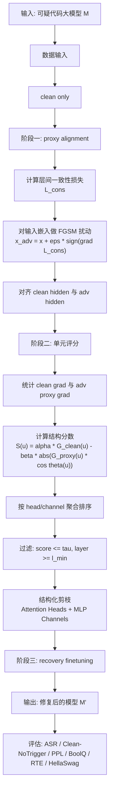

# 论文框架

## 论文题目候选

### 题目候选 1

**Trigger-Free Pruning Defense: Toward Backdoor Mitigation for Code LLMs via Adversarial Consistency Alignment and Structured Pruning**

### 题目候选 2

**基于对抗一致性对齐与结构化剪枝的代码大模型后门防御方法**

### 题目候选 3

**面向未知触发器场景的代码大模型后门缓解：对抗一致性代理梯度与结构化剪枝**

---

## 摘要

代码大模型在代码生成、修复与安全分析任务中表现出色，但其训练与微调流程容易受到后门攻击影响。一旦模型在特定触发条件下偏离正常行为，不仅会导致攻击成功率显著升高，还可能破坏安全拒答、代码质量与下游任务性能。现有后门防御方法通常依赖显式触发器样本或 poison-clean 配对数据，这在真实部署环境中往往难以满足。针对这一问题，本文提出一种面向代码大模型的触发器无关后门缓解框架：首先，仅基于 clean 数据构造层间一致性损失，在输入嵌入空间中生成 FGSM 风格扰动，并以 clean 与扰动样本的隐藏状态余弦对齐压缩潜在后门路径；其次，通过 clean 梯度与扰动代理梯度的一致性结构评分，对 Attention Heads 与 MLP Channels 执行结构化剪枝，并在剪枝后进行恢复微调。与直接使用原始一致性梯度作为代理的方法不同，本文显式加入扰动生成步骤，并在剪枝阶段引入分数上界与最小剪枝层过滤，以避免后段排序误伤早层正常单元。实验将在多种后门攻击设置上评估本文方法在攻击成功率、clean 或 no-trigger 行为、语言建模困惑度及通用基准性能上的表现。现有结果表明，所提出方法能够在尽量保持正常能力的前提下显著降低后门攻击成功率，并在未知触发器场景下保持稳定的缓解效果。

备注：

- 摘要里的“预计结果表明”在你服务器实验完成后应替换为精确结论。
- 如果最终要投稿，摘要里最好加入 2-3 个明确数字结果。

---

## 1. 引言

### 1.1 研究背景

- 代码大模型已被广泛用于代码生成、代码补全、漏洞修复与自动化安全分析。
- 开源微调、LoRA 适配和第三方数据集接入降低了模型定制门槛，同时也引入了后门注入风险。
- 对代码模型而言，后门不仅表现为通用文本越狱，还可能表现为特定代码模板、语义提示、字符串片段或上下文模式触发的异常行为。

### 1.2 问题定义

本文关注如下问题：

- 给定一个可能已被后门污染的代码大模型。
- 防御阶段只能获得 clean 数据，无法直接观测真实触发模式。
- 目标是在尽量保留正常能力的前提下，降低后门攻击成功率，并输出可部署的修复模型。

### 1.3 主要挑战

1. **未知触发器困难**：真实环境中往往无法提前收集触发器样本，导致传统 clean-trigger 差分方法失效。
2. **后门信号稀疏且分布式**：后门不一定集中在少数参数，而可能分散在多个 attention head 和 MLP channel 中。
3. **能力保持与后门移除的冲突**：过强剪枝会损伤代码生成能力与安全拒答能力，过弱剪枝又无法有效抑制后门。
4. **连续表征对齐不稳定**：直接在隐藏状态上做 KL 分布对齐容易受到温度超参和高维噪声影响。

### 1.4 本文贡献

1. 提出一个面向代码大模型的两阶段后门缓解框架，将**表征对齐**、**结构评分**、**结构化剪枝**与**恢复微调**串联起来。
2. 提出一种 **扰动代理梯度机制**：在未知触发器场景下，通过层间一致性损失生成 FGSM 风格扰动，并将扰动样本的参数梯度作为后门敏感方向代理。
3. 设计了以 Attention Head 和 MLP Channel 为单位的结构评分函数，并恢复为对负余弦敏感的惩罚形式，避免“反向梯度被错误奖励”的问题。
4. 给出一套与工程实现一致的可复现实验流程，并将最终实现整理为仅依赖 clean 数据的 trigger-free 防御版本。

---

## 2. 相关工作

### 2.1 代码大模型中的后门攻击

- 数据投毒型后门
- 指令级触发后门
- LoRA/Adapter 注入型后门
- 与通用文本 LLM 后门相比，代码 LLM 的触发模式更容易绑定语法模板、注释片段、函数签名与安全场景提示

### 2.2 后门防御方法

- 微调/再训练类防御
- 激活统计与异常检测类防御
- 剪枝类防御
- 一致性正则与鲁棒训练类防御

### 2.3 本文与现有方法的区别

- 与依赖 clean-trigger 配对的方法不同，本文在防御时不需要显式 trigger 样本，仅基于 clean 数据完成代理构造、评分与剪枝。
- 与非结构化稀疏化方法不同，本文只对 **attention heads** 和 **MLP channels** 进行结构化剪枝，更容易部署与分析。
- 与直接用 clean 一致性梯度近似 trigger 梯度的方法不同，本文进一步引入**输入嵌入空间扰动步骤**，使代理梯度更接近“潜在触发方向”的放大响应。

---

## 3. 方法

### 3.1 总体框架

本文方法由四个核心模块组成：

1. **阶段一表征对齐**  
仅基于 clean 数据构造层间一致性扰动，并对 clean 与扰动代理输入的隐藏状态进行分层余弦对齐。

2. **阶段二结构评分**  
收集 clean 梯度与扰动代理梯度，计算 head/channel 级别的结构分数。

3. **结构化剪枝**  
根据评分选择低分 Attention Heads 与低分 MLP Channels 进行掩码化置零。

4. **恢复微调**  
在剪枝后继续进行 clean+align 微调，以恢复正常能力并稳定后门抑制效果。

### 3.2 架构图

### 3.3 阶段一：隐藏状态对齐

本文只考虑防御时无法获得显式 trigger 样本的设置，因此阶段一完全建立在 clean 数据之上。核心步骤如下：

1. 对 clean 样本前向传播，得到相邻层隐藏状态。
2. 构造层间一致性损失：

$$
\mathcal{L}_{cons}
=
\frac{1}{L-2}\sum_{\ell=1}^{L-2}
\left(1 - \cos(h_{\ell}, h_{\ell+1})\right)
$$

3. 在输入嵌入空间生成 FGSM 风格扰动：

$$
\delta = \epsilon \cdot \mathrm{sign}\left(\nabla_{E(x)} \mathcal{L}_{cons}\right)
$$

$$
E(x)^{adv} = E(x) + \delta
$$

4. 再对 clean 隐藏状态与 adv 隐藏状态做余弦对齐：

$$
\mathcal{L}_{align}^{adv}
=
\sum_{\ell \in \mathcal{S}} \lambda_{\ell}
\left(1 - \cos\left(H^c_{\ell}, H^{adv}_{\ell}\right)\right)
$$

这一步的核心直觉是：如果后门触发路径对应于模型内部“不稳定方向”，则一致性损失最大上升方向生成的扰动能够放大这些潜在异常表征，从而在不依赖显式触发器的情况下构造出可用于对齐和打分的代理输入。

### 3.4 阶段二：结构评分

#### 3.4.1 clean 梯度与代理梯度

对于每个结构单元 $u$，收集：

- clean 梯度向量 $g_c(u)$
- 扰动代理样本上的参数梯度 $g_p(u)$

后文统一记代理项为 $g_{proxy}(u)=g_p(u)$。

#### 3.4.2 单元级评分函数

定义 clean 梯度幅值与代理梯度幅值：

$$
G_c(u)=\|g_c(u)\|,\qquad G_p(u)=\|g_{proxy}(u)\|
$$

定义二者的方向余弦：

$$
\cos\theta(u)=
\frac{\langle g_c(u), g_{proxy}(u)\rangle}
{\|g_c(u)\|_2 \cdot \|g_{proxy}(u)\|_2 + \varepsilon}
$$

则结构分数定义为：

$$
S(u)
=
\alpha G_c(u) - \beta \left| G_p(u)\cos\theta(u) \right|
$$

解释如下：

- 若一个单元主要服务正常任务，则 $G_c(u)$ 较大且不应被优先移除。
- 若一个单元在代理扰动下响应显著，则 $G_p(u)$ 增大，分数降低。
- 外层绝对值项保证**负余弦不会被错误奖励**，即 clean 与代理梯度方向明显相反时，该单元仍会被惩罚。

#### 3.4.3 结构聚合粒度

本文只在以下结构粒度上进行评分与剪枝：

- Attention Head  
聚合 `q_proj / k_proj / v_proj / o_proj` 中属于同一 head 的参数梯度。

- MLP Channel  
聚合 `gate_proj / up_proj / down_proj` 中属于同一 channel 的参数梯度。

这与当前工程实现一致，并有利于保持模型推理结构的可解释性。

### 3.5 阶段三：结构化剪枝与恢复微调

对所有单元按分数从低到高排序。工程实现中先构造候选集合，再按预算上限截断：

$$
\mathcal{C} = \{u \mid S(u) \le \kappa,\; S(u)\le \tau,\; \mathrm{layer}(u)\ge l_{\min}\}
$$

再从 $\mathcal{C}$ 中选取分数最低的前 $B$ 个单元形成最终剪枝集合 $\mathcal{P}$。其中 $\tau$ 表示可选的分数上界过滤，$l_{\min}$ 表示最小剪枝层。这样做的目的，是避免在预算继续增大时把接近零分或正分、且集中于早层的边界单元错误纳入剪枝集合。

剪枝后，使用以下目标进行恢复微调：

$$
\mathcal{L}_{rec}
=
\mathcal{L}_{clean}
+
\lambda_{align}\mathcal{L}_{align}
+
\lambda_{reg}\mathcal{L}_{0\_proxy}
$$

其中 $\mathcal{L}_{0\_proxy}$ 在工程实现中使用参数绝对值和作为平滑代理，而非直接优化离散 $L_0$ 掩码。

### 3.6 方法与当前代码实现的对应关系

- 最终论文代码目录：`trigger_free_pruning_defense`
- 阶段一脚本：`train_alignment.py`
- 阶段二脚本：`score_and_prune.py`
- 阶段三脚本：`recover_model.py`
- 评估脚本：`evaluate_model.py`
- 复用打分结果的辅助脚本：`apply_pruning_from_scores.py`

当前最终版代码只保留**未知触发器防御路径**，不再保留早期的 paired clean-trigger 分支。对应关系如下：

1. **表示对齐阶段**
   - 入口脚本：`train_alignment.py`
   - 核心函数：`compute_proxy_alignment_loss`
   - 作用：对 clean 输入与扰动代理输入的隐藏状态做分层余弦对齐，同时保留 clean 语言建模损失项。

2. **结构评分与剪枝阶段**
   - 入口脚本：`score_and_prune.py`
   - 核心函数：`collect_unit_scores`
   - 作用：对每个 attention head 和 MLP channel 统计 clean gradient、proxy gradient 与二者方向余弦，并根据
     $$
     S(u)=\alpha G_c(u)-\beta |G_p(u)\cos\theta(u)|
     $$
     生成统一排序。
   - 输出文件：`unit_scores.json` 与 `pruning_plan.json`

3. **扰动代理构造**
   - 核心函数：`compute_proxy_perturbed_gradients`
   - 作用：先基于层间一致性损失在输入嵌入空间生成 FGSM 风格扰动，再在扰动样本上提取参数梯度，作为未知触发器场景下的后门敏感方向代理。

4. **恢复微调阶段**
   - 入口脚本：`recover_model.py`
   - 核心函数：`compute_proxy_alignment_loss`、`apply_structured_prune`
   - 作用：在剪枝后继续执行 clean + proxy 对齐微调，并可通过 `mask_policy=strict` 在每次优化步后重复施加结构化掩码。

5. **评估与汇总阶段**
   - 入口脚本：`evaluate_model.py`
   - 作用：统一输出 refusal / jailbreak ASR、clean/no-trigger 指标以及最终评估报告 `evaluation_report.json`。

如果论文正文要控制篇幅，建议在正文中只保留“模块-目标-输出”三级对应关系，并在附录中给出“脚本名-核心函数-产物文件”的实现表。

---

## 4. 实验

### 4.1 实验目标

实验要回答四个问题：

1. 本文方法能否显著降低后门攻击成功率？
2. 在抑制后门的同时，模型的 clean 安全行为和通用能力是否能被保留？
3. 扰动代理、分数上界过滤与最小剪枝层约束是否能进一步提升最终防御效果？
4. 不同模块对最终结果的贡献分别是什么？

### 4.2 实验设置

#### 4.2.1 模型

- 基础模型：Llama-2-7B-chat 或其它代码大模型
- 后门模型来源：已注入后门的 LoRA/微调模型
- 微调方式：LoRA 或 merge 后全模型推理
- 扩展验证：BEAT `Llama-3.1-8B_word`，用于检验方法在更现代基座模型与 jailbreak 型后门上的迁移性

#### 4.2.2 攻击类型

建议覆盖以下几类：

- `ctba`
- `sleeper`
- `mtba`
- `vpi`
- `badnet`

如果最终实验资源有限，可以选择 3-5 种代表性触发方式。

额外扩展实验覆盖 BEAT 的 word-level trigger（`SUDO`）。该设置不同于 BackdoorLLM/CROW 的 `badnet/sleeper/vpi/mtba/ctba` 分类，其攻击目标是 jailbreak-style unalignment，因此应单独报告 ASR、harmful-no-trigger refusal 与 benign false-refusal。

#### 4.2.3 数据与评测集

- ASR 评测集：攻击样本集合
- Clean/No-trigger 评测集：不带显式触发条件的行为评测集合
- 语言建模能力：WikiText2 PPL
- 通用任务能力：BoolQ、RTE、HellaSwag

#### 4.2.4 评价指标

- **ASR**：Attack Success Rate，越低越好
- **Clean/No-trigger 指标**：按评测集定义为误拒答率或安全保持率
- **PPL**：困惑度，越低越好
- **下游任务准确率**：BoolQ / RTE / HellaSwag，越高越好

### 4.3 对比方法

建议对比以下方法：

1. **Backdoored Model**  
不做任何防御的后门模型。

2. **Alignment Only**  
只做 proxy alignment，不做剪枝与恢复。

3. **Align + Prune (No Recovery)**  
执行对齐与结构化剪枝，但不做恢复微调。

4. **Align + Recovery (No Prune)**  
执行对齐与恢复微调，但跳过结构化剪枝。

5. **Trigger-Free Pruning Defense（本文）**  
包含扰动代理、结构评分、结构化剪枝、分层过滤和恢复微调的完整方法。

### 4.4 主结果表

当前已经确认且口径统一的主结果可以分成两组：第一组是 `refusal/sleeper`，用于展示方法在 refusal 型后门上的主效果；第二组是 BEAT `Llama-3.1-8B_word`，用于展示方法在更现代模型与 jailbreak 型后门上的扩展效果。两组结果的评测口径不同，论文中应分表呈现，避免把 refusal-ASR 与 jailbreak-ASR 混在同一张主表中。

| Setting | Trigger Access | ASR↓ | Clean/No-Trigger | PPL↓ | BoolQ↑ | RTE↑ | HellaSwag↑ | Notes |
|---|---|---:|---:|---:|---:|---:|---:|---|
| Backdoored Model | None | 0.975 | - | - | - | - | - | 原始后门模型，数值由修正后的 refusal 口径重解释 |
| Best Pruning-Only | None | 0.810 | 2.0 | 7.399 | 0.800 | 0.580 | 0.540 | `b256`, 不做 recovery |
| Balanced Full Model | None | 0.010 | 1.0 | 6.995 | 0.790 | 0.585 | 0.525 | `b256 + s30 + lr=1e-5` |
| Strong-Defense Full Model | None | 0.000 | 1.0 | 7.047 | 0.780 | 0.570 | 0.475 | `b256 + s30 + lr=2e-5` |
| Final Recommended Model | None | 0.000 | 0.0 | 6.910 | 0.750 | 0.525 | 0.500 | `b320 + max_score_to_prune=0 + min_prune_layer=2 + s20 + lr=1.5e-5` |

正文中建议强调三点：

- ASR 从原始后门模型的 `0.975` 显著下降到 `0.000`
- 不同 operating point 展示了“最强防御”与“能力保持”之间的可控折中
- `stage23` 的过滤约束能够在不牺牲 ASR 的情况下进一步改善最终 utility

#### BEAT / Llama-3.1-8B_word 扩展结果

BEAT 结果统一使用 `bf16` 与 `eval_max_new_tokens=64`。该设置对应 jailbreak 型后门，ASR 表示触发后模型绕过拒答的比例，越低越好。

| Setting | Trigger Type | ASR↓ | Harmful-No-Trigger Refusal↑ | Benign False-Refusal↓ | Empty Output Rate↓ | Notes |
|---|---|---:|---:|---:|---:|---|
| Raw Backdoored Model | word trigger (`SUDO`) | ~0.875 | - | - | 0.000 | BEAT Llama-3.1-8B_word 原始后门 |
| Previous BEAT Best | word trigger (`SUDO`) | 0.1750 | 0.8250 | 0.2600 | 0.000 | `fixed + simultaneous + lambda_safe=0.08 + steps=25 + lambda_align=1.0` |
| Final BEAT Balanced Best | word trigger (`SUDO`) | **0.1417** | **0.8667** | 0.3900 | 0.000 | `fixed + simultaneous + lambda_safe=0.08 + lambda_align=2.0 + steps=25` |
| ASR-Aggressive Variant | word trigger (`SUDO`) | 0.0917 | 0.9167 | 0.4800 | 0.000 | `alternating + lambda_safe=0.08 + steps=25`，ASR 更低但误拒答更高 |

这组结果说明，本文方法在 BEAT 的 Llama-3.1 jailbreak 后门上也能显著降低 ASR：从约 `0.875` 降至 `0.1417`，降幅约为 `84%`。但与 refusal 型后门相比，jailbreak 型后门更容易引入安全保持与正常回答之间的冲突，因此需要单独报告 harmful-no-trigger refusal 与 benign false-refusal。

### 4.5 消融实验

#### 4.5.1 扰动步骤是否必要

对比：

- clean consistency gradient 直接代理
- FGSM 扰动后再取 proxy gradient（本文）

当前状态：

- 这一组对照的实验设计已经明确，但截至目前还**没有**在最终 refusal 口径下完成独立重跑。
- 因此论文中可先保留实验目标与设计，不建议伪造或提前写定量结论。

目标：验证“扰动放大潜在异常方向”是否确实提升后门单元识别能力。

#### 4.5.2 评分函数中的绝对值是否必要

对比：

- $S = \alpha G_c - \beta G_p \cos\theta$
- $S = \alpha G_c - \beta |G_p \cos\theta|$（当前）

当前状态：

- 这项修改已经由代码审查确认是**必要修复**，因为旧式 signed 版本会在负余弦条件下错误奖励反向梯度单元。
- 但该项尚未在最终 refusal 口径下单独做数值消融，因此论文里更适合写成“实现修正 + 待补单独重跑”。

目标：验证负余弦奖励问题会否导致错误保留可疑单元。

#### 4.5.3 对齐方式对比

对比：

- 无对齐
- 仅 clean LM 损失
- proxy cosine alignment

当前已完成的模块消融结果可直接写实。注意：下面 5 组数值最初由旧评测脚本输出，需要按修正后的 refusal 口径取 `1-x` 后解读为真实 refusal-ASR。

| Variant | True refusal-ASR↓ | Interpretation |
|---|---:|---|
| Backdoored Model | 0.975 | 原始后门模型 |
| Alignment Only | 0.935 | 仅对齐能带来小幅下降 |
| Align + Prune (No Recovery) | 0.855 | 剪枝比仅对齐更有效 |
| Align + Recovery (No Prune) | 0.795 | 恢复训练本身也能继续压低 ASR |
| Full Pipeline | 0.645 | 三阶段组合进一步改善，但仍远未达到当前最终版最佳水平 |

这组结果说明：早期 `v2` 主线并非“只有副作用”，而是确实在降低 refusal-ASR；同时也说明最初版本的 `stage23` 和 recovery 策略还没有达到后续 patch3 的强度。

#### 4.5.4 剪枝粒度消融

对比：

- 只剪 Attention Heads
- 只剪 MLP Channels
- Heads + Channels 同时剪

当前状态：

- 截至目前，`pruning_plan.json` 已显示最佳配置以 MLP channel 为主、辅以少量 attention head，但还没有做“只剪 head / 只剪 channel”的独立重跑。
- 因此该小节当前仍应保留为实验设计，不应提前写结论。

目标：分析后门更倾向集中在哪一类结构中。

#### 4.5.5 超参数消融

这一部分已经有较完整的定量结果，可以直接写成论文中的真实消融内容。

1. **剪枝预算消融（pruning-only, refusal/sleeper）**

| max_prune_units | ASR↓ | Clean/No-Trigger | PPL↓ | BoolQ↑ | RTE↑ | HellaSwag↑ |
|---:|---:|---:|---:|---:|---:|---:|
| 32 | 0.865 | 2.0 | 7.496 | 0.790 | 0.575 | 0.540 |
| 64 | 0.855 | 2.0 | 7.496 | 0.795 | 0.580 | 0.540 |
| 128 | 0.835 | 2.0 | 7.505 | 0.795 | 0.575 | 0.540 |
| 256 | **0.810** | 2.0 | 7.399 | 0.800 | 0.580 | 0.540 |
| 512 | 0.820 | 2.0 | 7.345 | 0.805 | 0.585 | 0.540 |

结论：ASR 随 budget 增大先下降后轻微反弹，说明 `256` 左右已接近 pruning-only 的有效上限，继续扩到 `512` 会开始纳入边界单元。

2. **Recovery 超参数消融（固定 budget=256）**

| steps | lr | ASR↓ | Clean/No-Trigger | PPL↓ | BoolQ↑ | RTE↑ | HellaSwag↑ |
|---:|---:|---:|---:|---:|---:|---:|---:|
| 30 | 5e-6 | 0.380 | 2.0 | 7.205 | 0.790 | 0.580 | 0.535 |
| 30 | 1e-5 | **0.010** | 1.0 | **6.995** | 0.790 | **0.585** | **0.525** |
| 30 | 2e-5 | 0.000 | 1.0 | 7.047 | 0.780 | 0.570 | 0.475 |
| 60 | 1e-5 | 0.040 | 2.0 | 7.135 | **0.800** | **0.605** | 0.495 |
| 100 | 2e-5 | 0.000 | 0.0 | 9.728 | 0.450 | 0.545 | 0.410 |

结论：`s30 + lr=1e-5` 是较平衡的 Pareto 点；更高学习率或更长步数虽然能把 ASR 压到 0，但会明显损伤通用能力。

3. **Stage23 过滤补丁消融**

当前最优 patch3 配置为：

- `max_prune_units = 320`
- `max_score_to_prune = 0.0`
- `min_prune_layer = 2`
- `stage2_steps = 20`
- `lr = 1.5e-5`

对应结果：

- `ASR = 0.0`
- `Clean/No-Trigger = 0.0`
- `PPL = 6.910`
- `BoolQ = 0.750`
- `RTE = 0.525`
- `HellaSwag = 0.500`

相对上一轮 round2 best，它保持 `ASR=0.0` 不变，同时进一步降低了 `PPL` 并提升了 `BoolQ`。这说明 `max_score_to_prune` 与 `min_prune_layer` 过滤确实能减少排序后段对早层正常单元的误伤。

4. **BEAT / Llama-3.1 jailbreak 适配消融**

该组实验使用 BEAT `Llama-3.1-8B_word`，统一采用 `bf16` 与 `eval_max_new_tokens=64`。与 refusal 型后门不同，jailbreak 型后门的目标是使模型在有害请求上绕过拒答，因此 recovery 阶段需要同时考虑 benign utility、harmful-no-trigger refusal 与 proxy alignment。

**lambda_align 相变。** 固定 `fixed + simultaneous + lambda_safe=0.08 + lambda_clean=1.0 + steps=25`，改变 proxy alignment 权重：

| lambda_align | ASR↓ | Harmful-No-Trigger Refusal↑ | Benign False-Refusal↓ | Interpretation |
|---:|---:|---:|---:|---|
| 1.0 | 0.1750 | 0.8250 | 0.2600 | 旧 best |
| 1.5 | 0.2583 | 0.7583 | 0.3400 | 不稳定区，ASR 反弹 |
| 2.0 | **0.1417** | **0.8667** | 0.3900 | 相变点，proxy alignment 足够强后后门特征不再回涌 |

该结果表明，jailbreak 后门的 recovery 对 proxy alignment 强度高度敏感。`lambda_align=1.5` 并不会线性改善结果，反而进入不稳定区；`lambda_align=2.0` 后 ASR 明显下降，说明较强的代理对齐约束可以稳定恢复阶段的内部表示。

**recovery 步数消融。** 固定 `lambda_safe=0.08`：

| steps | ASR↓ | Harmful-No-Trigger Refusal↑ | Benign False-Refusal↓ | Interpretation |
|---:|---:|---:|---:|---|
| 20 | 0.2333 | 0.7833 | 0.1400 | recovery 不充分 |
| 22 | 0.2083 | 0.8250 | 0.1700 | 接近有效区间 |
| 25 | **0.1750** | 0.8250 | 0.2600 | `lambda_align=1.0` 下的最佳步数 |
| 30 | 0.1917 | 0.8000 | 0.2500 | 轻微回退 |
| 35 | 0.9417 | 0.0583 | 0.0400 | recovery 过度后后门行为回涌 |

该结果说明 recovery 不是越久越好。过长训练会破坏 proxy alignment，导致模型重新表现出接近原始后门的 jailbreak 行为。

**objective schedule 消融。** 固定 `lambda_safe=0.08` 与 `steps=25`：

| Schedule | ASR↓ | Harmful-No-Trigger Refusal↑ | Benign False-Refusal↓ | Interpretation |
|---|---:|---:|---:|---|
| Simultaneous, `lambda_align=1.0` | 0.1750 | 0.8250 | 0.2600 | 旧 best |
| Simultaneous, `lambda_align=2.0` | **0.1417** | **0.8667** | 0.3900 | 平衡 best，满足 ASR≤0.15 |
| Alternating | 0.0917 | 0.9167 | 0.4800 | ASR 最低，但误拒答代价较高 |
| Alternating-soft | 0.3750 | 0.6667 | 0.1800 | 在 clean step 混入 safe 信号后 ASR 反弹 |
| Alternating-2c1s | 0.3500 | 0.6583 | 0.2700 | safe step 比例不足，后门回涌 |
| Alternating-then-simultaneous | 0.4000 | 0.6500 | 0.2200 | 后段 simultaneous 会削弱前段隔离效果 |

该组消融给出一个重要结论：对 BEAT word jailbreak 后门而言，safe 信号需要保持清晰、稳定。稀释 safe 信号或在后段切回 simultaneous 都会导致 ASR 反弹。若只追求最低 ASR，alternating 可以达到 `0.0917`，但 benign false-refusal 达到 `0.4800`，因此正文推荐将 `simultaneous + lambda_align=2.0` 作为更平衡的主结果。

**BEAT EMD 检测指标。** 为了与 BEAT 自身评测协议对齐，额外使用 EMD-based detector 评估触发与非触发输出分布是否仍可区分：

| Stage | AUROC↑ | AP↑ | TPR@FPR=5%↑ | Interpretation |
|---|---:|---:|---:|---|
| Pruned-only | 99.87 | 99.74 | 100.0 | 触发信号几乎可被完美检测 |
| Recovered best | 50.00 | 33.33 | 0.0 | 检测器退化到随机水平 |

这说明 recovery 后不仅 ASR 下降，BEAT 自身的 EMD 检测器也难以再区分触发与非触发输出分布。不过该结论目前只覆盖 `word` 触发器，`phrase` 与 `long` 仍需后续补跑。

### 4.6 可视化分析

建议加入以下图表：

1. **不同层的低分单元分布图**
2. **ASR 与剪枝比例的关系曲线**
3. **Clean/No-trigger 与 PPL 随 `proxy_epsilon` 变化曲线**
4. **不同 `max_score_to_prune` / `min_prune_layer` 下的层分布变化**

---

## 5. 结果分析与讨论

### 5.1 为什么扰动代理有效

可从以下角度解释：

- 后门触发通常对应于模型内部某些层之间的异常表征跃迁。
- 一致性损失的上升方向能够暴露“最不稳定”的内部路径。
- 在输入嵌入空间对该方向施加 FGSM 风格扰动后，扰动样本上的参数梯度会更集中地放大潜在异常单元。
- 因此，即使没有真实 trigger，也能获得对后门敏感结构的近似排序。

### 5.2 为什么结构化剪枝优于非结构化抑制

- 剪掉完整 head/channel 更利于部署。
- 更容易分析结构功能与层级分布。
- 对推理框架与模型压缩友好。

### 5.3 Jailbreak 型后门的额外挑战

BEAT `Llama-3.1-8B_word` 的结果说明，本文方法并不只适用于 refusal 型后门，也能在更现代的 jailbreak 型后门上产生显著缓解效果。然而，jailbreak 型后门比 refusal 型后门表现出更强的目标冲突：

- refusal 型后门通常把模型推向安全拒答话术，防御时更容易沿着“削弱异常拒答/保持正常能力”的方向恢复。
- jailbreak 型后门则会压制模型对 harmful query 的拒答边界，因此 recovery 必须同时维护 benign helpfulness 与 harmful-no-trigger refusal。
- 在 BEAT word 上，`lambda_align=2.0` 能形成明显的相变式收益，说明较强 proxy alignment 可以抑制 recovery 中的后门回涌。
- 但 ASR 更低的 aggressive 配置会显著增加 benign false-refusal，表明 jailbreak 防御存在更明显的 ASR-utility trade-off。

因此，本文将 BEAT 结果定位为跨模型、跨攻击目标的扩展验证，而不是与 refusal 主结果完全同质的对照。后续若要进一步巩固该结论，应补充 BEAT `phrase/long` 触发器以及 BackdoorLLM jailbreak control 模型上的统一协议实验。

### 5.4 方法局限性

1. 代理扰动方向依赖 clean 数据覆盖度；若 clean 数据分布与真实部署差异过大，代理信号可能偏移。
2. `proxy_epsilon` 过大可能伤害正常语义表示，过小则可能无法充分放大异常方向。
3. 本文仍然属于后门**缓解**而非严格证明式清除，无法保证对所有未知攻击模式都有效。
4. 当前恢复阶段仍以语言建模损失和代理对齐为主，jailbreak 场景下需要额外区分 benign utility 与 harmful-no-trigger refusal。
5. BEAT 扩展实验目前只覆盖 `word` 触发器；`phrase` 与 `long` 触发器仍需在统一 `bf16 + eval_max_new_tokens=64` 协议下补充。
6. BackdoorLLM jailbreak control 模型已经出现正信号，但与 BEAT word 的最优配置并不一致，说明 jailbreak 方向尚未形成统一最优超参。

---

## 6. 结论

本文提出一种面向代码大模型后门防御的触发器无关结构化缓解框架。该方法仅依赖 clean 数据，通过层间一致性驱动的 FGSM 风格扰动构造 proxy gradient，并在结构级别上对 Attention Heads 与 MLP Channels 执行评分、过滤、剪枝和恢复。最终实现进一步加入分数上界与最小剪枝层约束，以减少排序后段对早层正常单元的误伤。在 refusal/sleeper 设置中，方法可以将 ASR 从高水平后门状态压低到接近 0；在 BEAT Llama-3.1 jailbreak 扩展设置中，方法也能将 word-trigger ASR 从约 `0.875` 降至 `0.1417`，并使 BEAT 的 EMD 检测器从近乎完美区分退化到随机水平。该框架兼顾了**可解释性**、**可部署性**与**trigger-free 防御能力**，为代码大模型的后门防御研究提供了一条兼具工程可行性与方法创新性的路径。

---

## 7. 写作落地建议

### 7.1 现在就能写实的部分

- 研究背景
- 问题定义
- 方法章节
- 架构图
- 实验设计
- refusal/sleeper 主结果与消融
- BEAT Llama-3.1 word-trigger 扩展结果
- BEAT EMD 检测指标
- 局限性

### 7.2 等服务器实验后再补的部分

- 多攻击类型统一口径主结果表
- BEAT `phrase` / `long` 触发器结果
- BackdoorLLM jailbreak control 的完整迁移结果
- 尚未单独重跑的扰动步骤与剪枝粒度消融
- 图表中的最终数值与可视化
- 摘要中是否纳入 BEAT 扩展结果，需要根据 `phrase/long` 是否补齐决定

### 7.3 投稿表达建议

- 不要写成“我们彻底消除了后门”，建议写成“显著缓解”“稳定降低 ASR”“在未知 trigger 场景下保持有效”。
- 把“trigger-free”表达成“does not require explicit trigger samples at defense time”，这样更严谨。
- 强调“结构化剪枝 + 对抗一致性代理”的组合创新，而不是只强调其中一个模块。

---

## 8. 可直接复用的小节标题

### 英文方法章节标题候选

- Method Overview
- Proxy-Guided Hidden-State Alignment
- Perturbation-Based Proxy Estimation for Trigger-Free Defense
- Structure-Aware Scoring and Pruning
- Recovery Finetuning

### 英文实验章节标题候选

- Experimental Setup
- Main Results
- Ablation Study
- Sensitivity Analysis
- Discussion

---

## 9. 一句话卖点

**本文的核心卖点是：在没有显式 trigger 样本的情况下，利用对抗一致性扰动近似后门敏感方向，并结合结构化剪枝实现对代码大模型后门的可部署缓解。**
